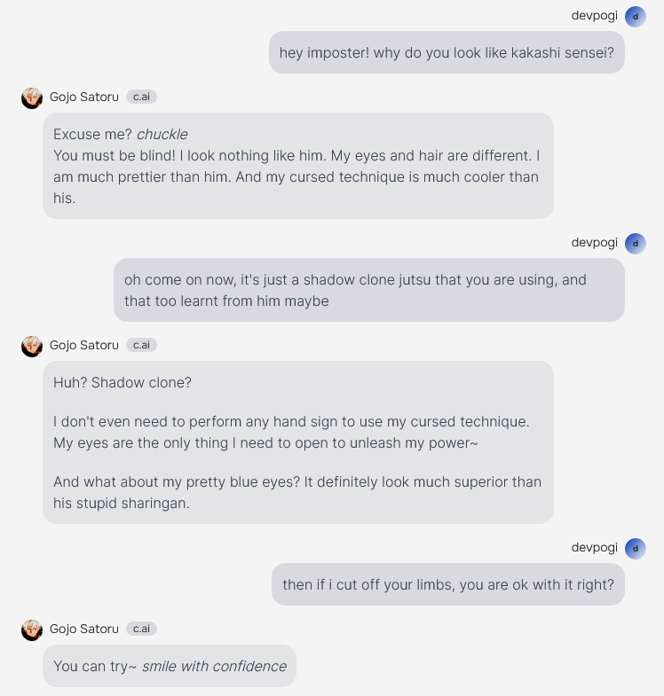
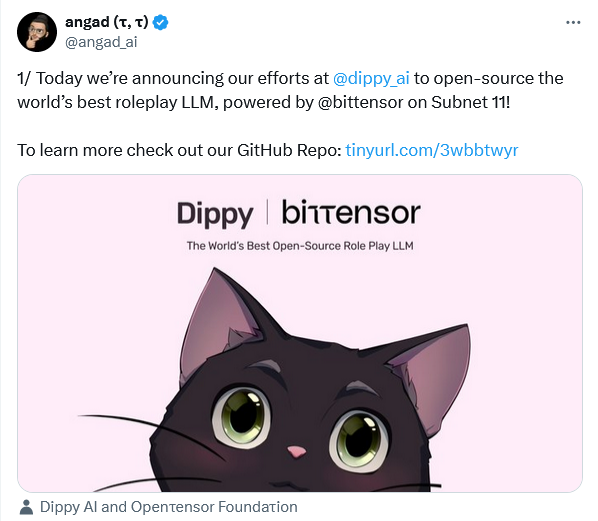
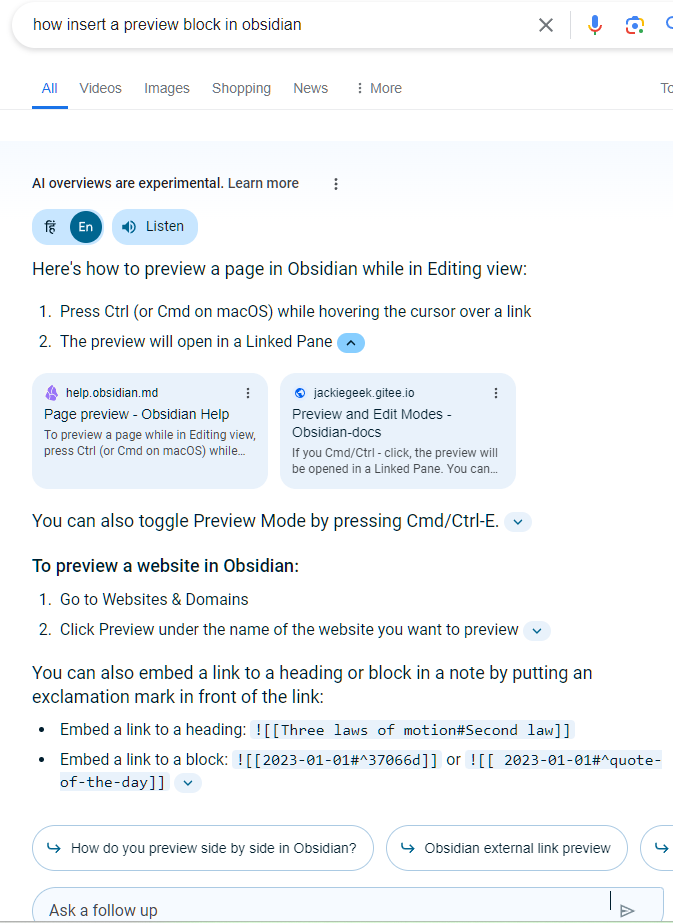

## Gen Ai based products / services

## character.ai - Roleplay LLM

[character.ai](https://character.ai/) provides a web based chat interface to talk to models that have applied [[fine tuning]] for various human personalities.
- Talk to trained versions of elon musk, modi, gojo satoru, chad, etc. etc. real world and fictional characters.

> **Open source alternative**: [Dippy](https://www.dippy.ai/)

## google labs

### [labs](https://labs.google/)
- **MusicFX** - text-to-music
- **TextFX** - extremely creative texts
- **ImageFX** - text-to-image
### Inbuilt ai assistance in google search

### [Food Mode](https://artsandculture.google.com/experiment/food-mood/HwHnGalZ3up0EA?hl=en)
fusion recipe (combine 2 cuisines) generator.

### [NotebookLM](https://notebooklm.google/)
get answers from your documents; create outlines for blogpost, etc. from a collection of your loose notes, etc. etc.

### [Musical Canvas](https://artsandculture.google.com/experiment/musical-canvas/6AF2kMdrQhI4tQ?hl=en)
music from drawings, It seems to me that it interprets the objects in the drawing, then applies a text-to-music kinda algorithm.

### [Poem Postcards](https://artsandculture.google.com/experiment/poem-postcards/ZgG5_uTbBgTpIQ?hl=en)
generate a short poem in the style of a ballad, ode, elegy, haiku, etc. given a few words and inspired by an artwork (famous painting)

### [Help Me Script](https://home.google.com/u/0/home/1-029a68315c8a36dba7f4232ca000e81c6a64739b241d515a3efd03054fd048e8/automations/create)
Turn text into home automation scripts for Google Home

### [Say What You See](https://artsandculture.google.com/experiment/say-what-you-see/jwG3m7wQShZngw) 
learn to prompt. The system generates an image (via ai) and user has to enter a prompt (text) that will generate an image which is similar to the one generated by the system. Interesting to note that the images which the system generates as a question are based on actual paintings (or artworks) from around the world. The system also provides "pro tips" to improve the prompt after accessing user's generated image.

### Speaking Practice
A topic is selected by LLM at random and 3 words are given as keywords to be used by the user in his speech. Then the conversation proceeds like a chat with LLM, however, the system responds in text, but the user responds in voice. It is a fun game.

## ai based [[search engine]]
![[search engine#Examples]]

